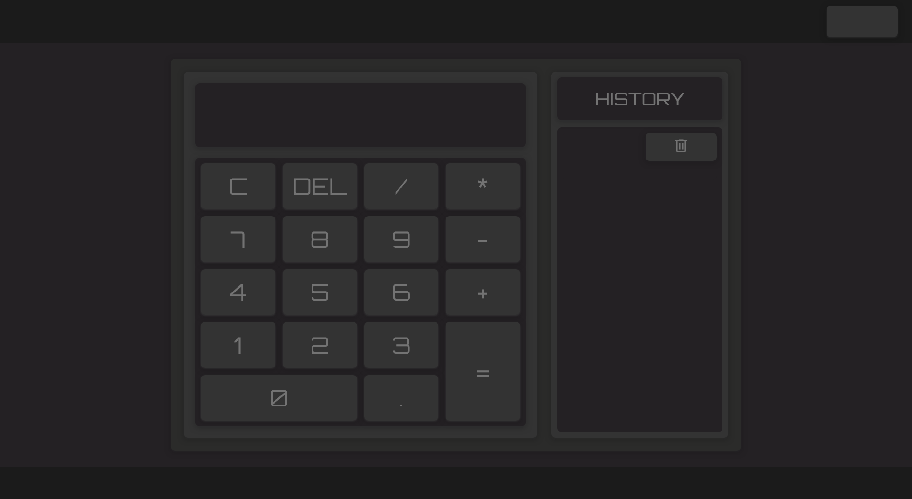
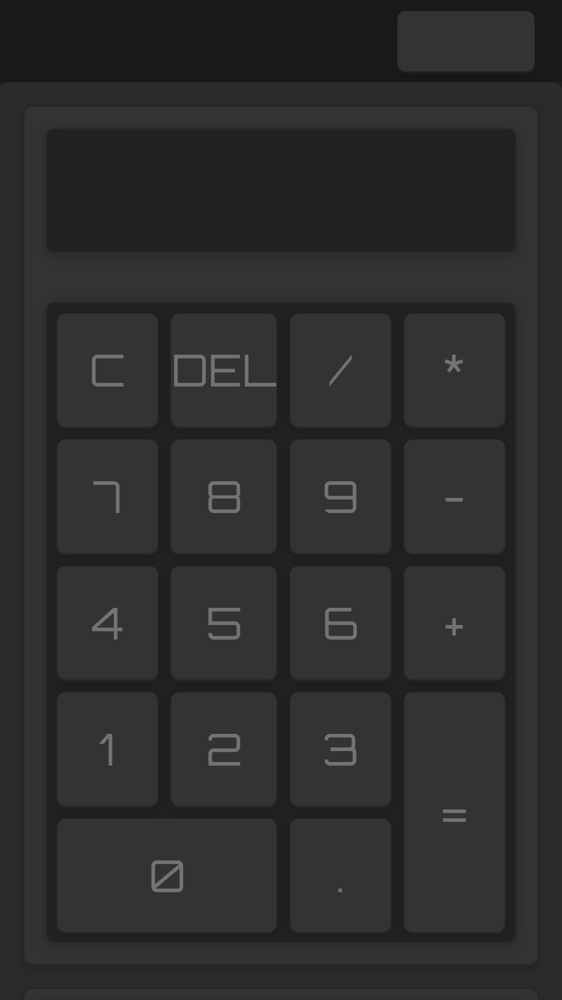
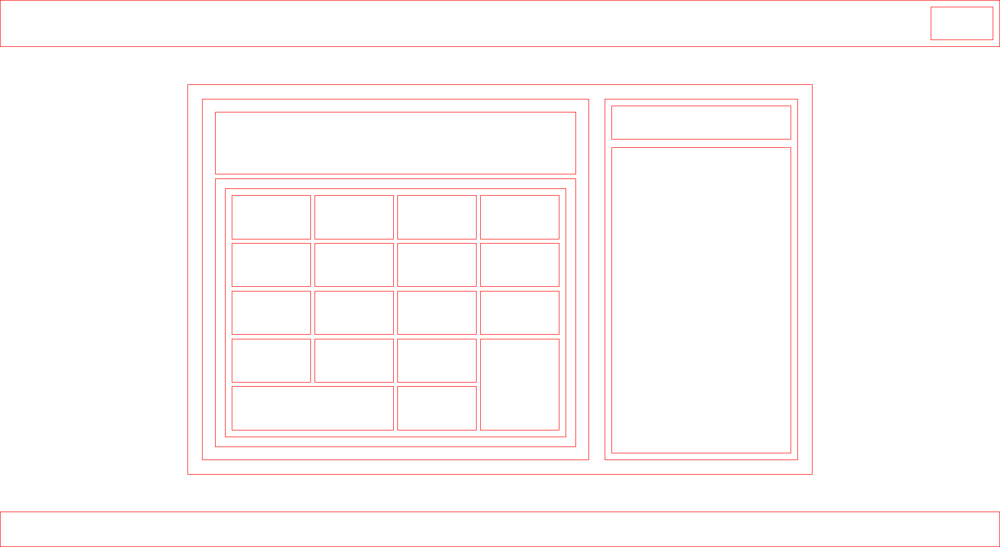

# calculator-js

## Description

Just a simple calculator that can be used in Light or Dark mode.
I also add a panel where you can see the history.

## Live Site

Feel free to visit the live version of the tribute page: [Visit site](https://jeru7.github.io/calculator-js/)

## Preview

### Desktop shot

### Mobile shot

### Layout

## Tech Stack

- HTML
- CSS
- BOOSTRAP 5
